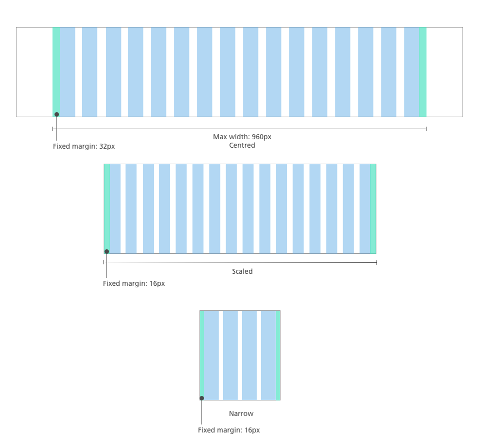
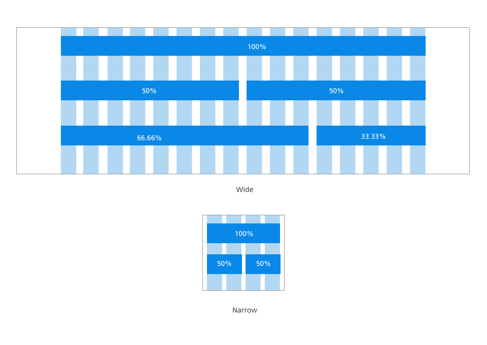
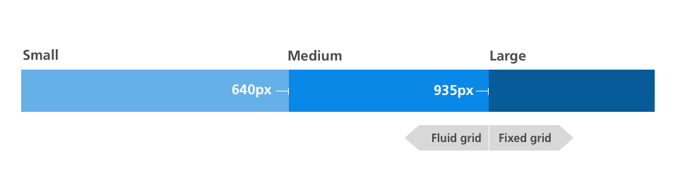
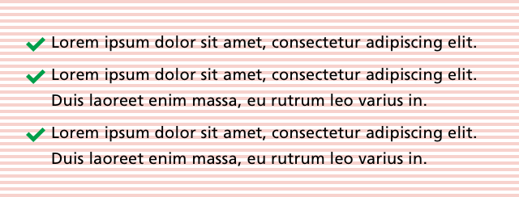
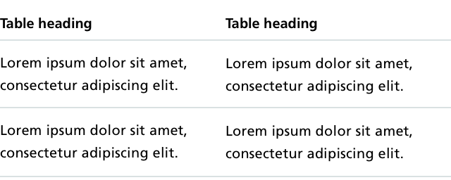
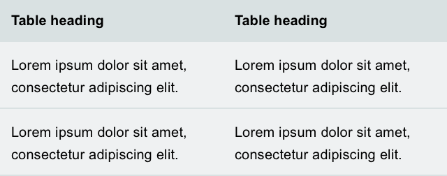
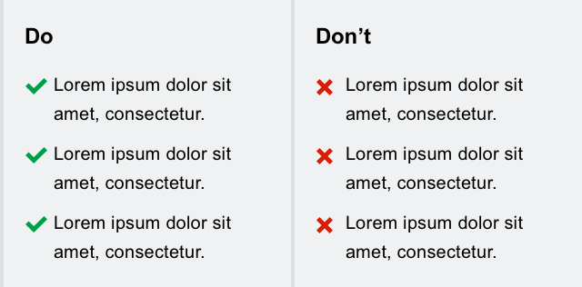

# NHS.UK experimental patterns

**This is not a pattern library.**


This a growing collection of patterns emerging from NHS.UK beta prototypes. They will continue to be iterated on. They are in no way finished or finalised.

- [Grid](#Grid)
- [Base](#base)
- [Callout](#callout)
- [Panel](#panel)

##Grid

This guideline explains how our flexible, percentage-based grid works and how you can use it.

### Overview

The NHS grid is a flexible 16 column grid, that has percentage-based columns and gutters.
It expands to a max width of 960px. At sizes above 960px the grid is centrally aligned.



### Spacing and layout
The grid uses fixed margins and gutters to help control the proportion and balance of the page. The margins and gutters are set to 16px for small screens and 32px for larger screens.

### Layouts
Any number of columns can be used to suit the content and create interesting layouts at different widths.

For layouts intended for use on smaller screens, we recommend using a maximum of 4 columns.



### BreakPoints
For simplicity, we are using 2 breakpoints, that results in three layouts. We expect these to expand and increase in complexity.



## Base

- Font TBC
- Body copy 20px
- Baseline grid 4px
- All margins, padding and line heights should be multiples of 4
- Headings in sentence case

### Headings


### Body copy


### Bullet list


### Numbered list


### Chevron list


```html
<ul class="list--chevron">
  <li>...</li>
</ul>
```

### Check list



```html
<ul class="list--check">
  <li>...</li>
</ul>
```

### Cross list


```html
<ul class="list--cross">
  <li>...</li>
</ul>
```

### Table



## Callout

Callouts are used to draw attention to a piece of content and prompt people to take action.  

#### Notes

- Six variants which roughly correspond with the urgency of the action to be taken
- Different border styles are used to differentiate other than by colour

### Muted

- Only used for 111 banner


```html
<div class="callout callout--muted">...</div>
```

### Info


```html
<div class="callout callout--info">...</div>
```

### Attention

- Used when escalating an action eg. See a GP if…


```html
<div class="callout callout--attention">...</div>
```

### Warning


```html
<div class="callout callout--warning">...</div>
```

### Alert


```html
<div class="callout callout--alert">...</div>
```

### Severe


```html
<div class="callout callout--severe">...</div>
```

### Compact

- Tighter padding
- Makes callout flow to width of content
- Can be applied to any callout


```html
<div class="callout callout--compact">...</div>
```

## Panel

- Mini content assembly
- Orientation/understanding/action

### Panel with header


```html
<article class="panel">
  <header class="panel__header">...</footer>
  <div class="panel__content">...</div>
</article>
```

### Panel with footer


```html
<article class="panel">
  <div class="panel__content">...</div>
  <footer class="panel__footer">...</footer>
</article>
```

### Panel table

- Comparison of binary lists where individual items have direct opposite



```html
<table class="panel">...</table>
```

### Panel with binary lists

- Comparison of binary themed lists where individual items are not directly opposing



```html
<article class="panel panel--binary">
  <div class="panel__column">
    <div class="panel__content">...</div>
  </div>
  <div class="panel__column">
    <div class="panel__content">...</div>
  </div>
</article>
```
