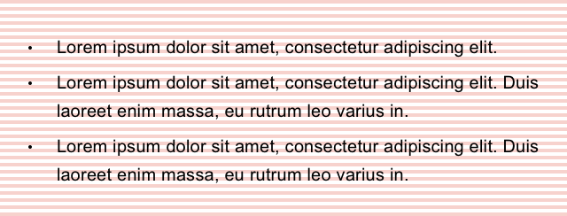
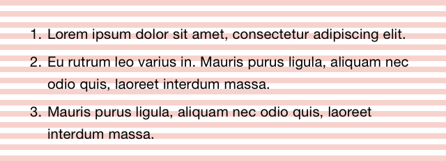
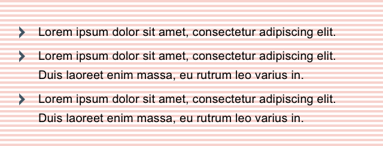
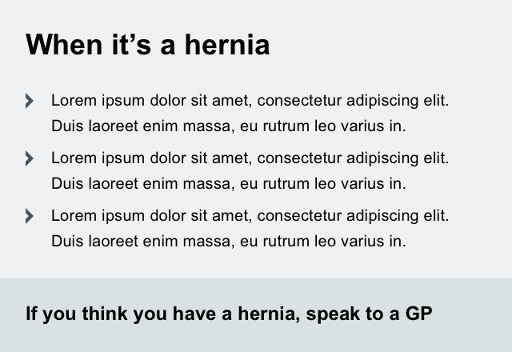

# NHS.UK experimental patterns

**This is not a pattern library.**


This a growing collection of patterns emerging from NHS.UK beta prototypes. They will continue to be iterated on. They are in no way finished or finalised.

- [Base](#base)
- [Callout](#callout)
- [Panel](#panel)


## Base

- Font TBC
- Body copy 20px
- Baseline grid 4px
- All margins, padding and line heights should be multiples of 4
- Headings in sentence case

### Headings


### Body copy


### Bullet list



### Numbered list



### Chevron list list



```
list--chevron
```


## Callout

Callouts are used to draw attention to a particular piece of content and/or prompt people to take action.  

#### Notes

- Six variants which roughly correspond with the urgency of the action to be taken
- Different border styles are used to differentiate other than by colour

### Muted


```
callout callout--muted
```

### Info


```
callout callout--info
```

### Attention


```
callout callout--attention
```

### Warning


```
callout callout--warning
```

### Alert


```
callout callout--alert
```

### Severe


```
callout callout--severe
```

### Compact

- Tighter padding
- Makes callout flow to width of content
- Can be applied to any callout


```
callout callout--compact
```

## Panel

- Mini content assembly
- Orientation/understanding/action

### Panel with header


```
panel 
panel__header
panel__content
```

### Panel with footer



```
panel 
panel__content
panel__footer
```
