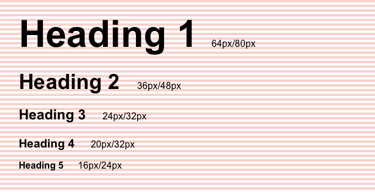
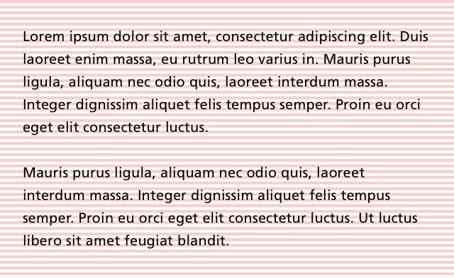
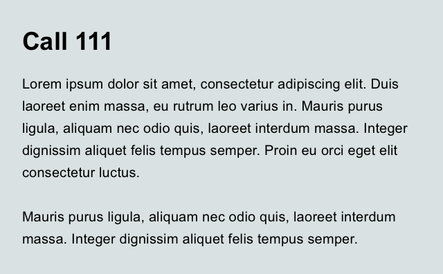
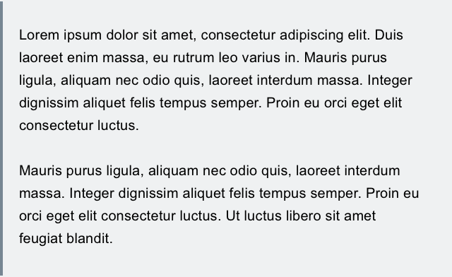
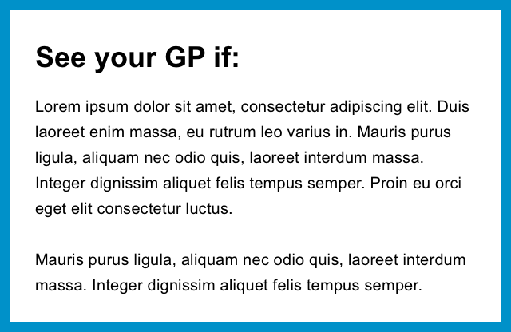
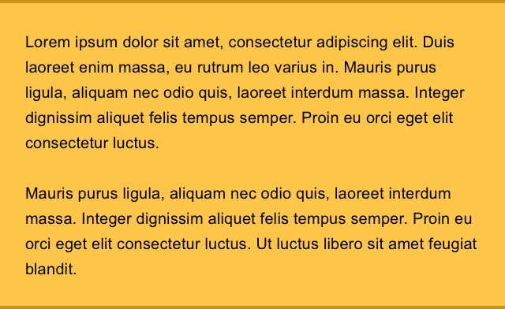
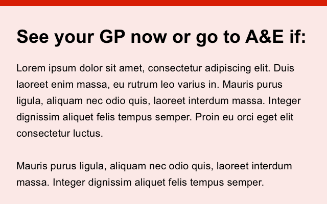
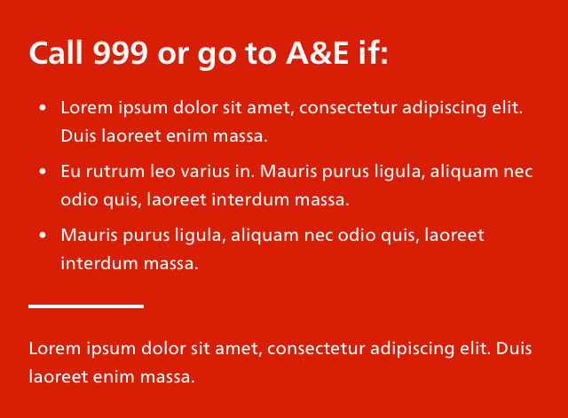

# NHS.UK experimental patterns

**This is not a pattern library.**


This a growing collection of patterns emerging from NHS.UK beta prototypes. They will continue to be iterated on. They are in no way finished or finalised.

- [Typography](#typography)
- [Callout](#callout)


## Base

#### Notes

- Font TBC
- Body copy 20px
- Baseline grid 4px
- All margins, padding and line heights should be multiples of 4

### Headings



### Body copy



### Bullet list


### Numbered list


### Chevron list list


```list--chevron```


## Callout

Callouts are used to draw attention to a particular piece of content and/or prompt people to take action.  

#### Notes

- Six variants which roughly correspond with the urgency of the action to be taken
- Different border styles are used to differentiate other than by colour

### Muted



```callout callout--muted```

### Info



```callout callout--info```

### Attention



```callout callout--attention```

### Warning



```callout callout--warning```

### Alert



```callout callout--alert```

### Severe



```callout callout--severe```
